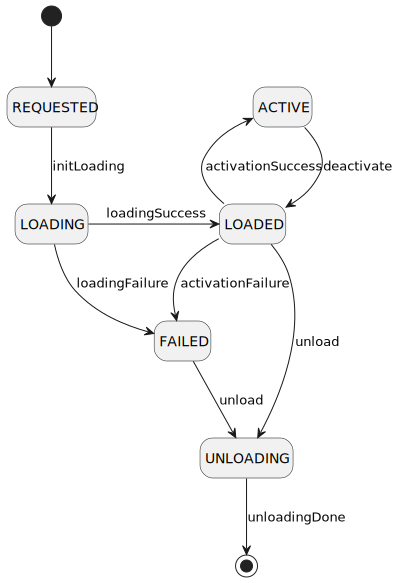

# KV Store Data Layout for Aether

## Main Data Structures

### Artifact
The triple describes artifact:
 - groupId
 - artifactId
 - version 

### Deployment Descriptor
 - Artifact (see above)
 - Instance count range 
 - List<EntryPoint> 


## Desired Configuration (DesCon)

```
slices - desired -+- <group-id-1>:<artifact-id-1>:<version-1> -> <descriptor-1>
                  +- <group-id-2>:<artifact-id-2>:<version-2> -> <descriptor-2>
                  +- ...
```

## Actual Configuration (ActCon)

```
slices - actual -+- <group-id-1>:<artifact-id-1>:<version-1> - [<nodeId-1>, <nodeId-2>, ... <nodeId-N>]
                 +- <group-id-2>:<artifact-id-2>:<version-2> - [<nodeId-1>, <nodeId-2>, ... <nodeId-N>]
                 +- ...
```


## Deployment Configuration (DepCon)

```
deployment -+- <nodeId-1> -+- <group-id-1>:<artifact-id-1>:<version-1> - state
            |              +- <group-id-2>:<artifact-id-2>:<version-2> - state
            +- <nodeId-2> -+- <group-id-3>:<artifact-id-3>:<version-3> - state
            |              +- <group-id-4>:<artifact-id-4>:<version-4> - state
            +- ...
```
Where state represents current position in the state machine:

<details>
```
REQUESTED -> (initLoading) LOADING
LOADING -> (loadSuccess) LOADED | (loadFailure) FAILED
LOADED -> (activate) ACTIVE | (activateFailure) FAILED | (unload) UNLOADING
ACTIVE -> (deactivate) LOADED
FAILED -> (unload) UNLOADING
UNLOADING -> (unloadDone) UNLOADED 
```
@startuml sliceStates

hide empty description
[*] --> REQUESTED

REQUESTED --> LOADING : initLoading
LOADING -> LOADED : loadingSuccess
LOADING --> FAILED : loadingFailure
LOADED -up-> ACTIVE : activationSuccess
LOADED --> FAILED : activationFailure
LOADED --> UNLOADING : unload
ACTIVE --> LOADED : deactivate
FAILED --> UNLOADING : unload
UNLOADING --> [*] : unloadingDone

@enduml

</details>



## Event Flow

1. Slice is published to DesCon
2. ClusterSliceManager analyzes configuration and chooses node(s) where it will be deployed.
The decision is published to the DepCon with the state REQUESTED.
3. Node listens to node configuration changes, and once the new value with the state REQUESTED appears, node starts the deployment process. The state is transitioned to LOADING.
4. Upon the end of the loading process, node changes state to ACTIVE or FAILED, depending on the result of the deployment.
5. Upon the change of the state to the ACTIVE, ClusterSliceManager updates ActCon accordingly.
6. If the state is FAILED, ClusterSliceManager requests slice shut down.
7. When ClusterSliceManager decides to shut down the slice, it makes the following changes:
- changes state to the UNLOAD
- removes node from the `actual` branch of the state
8. Node starts the unloading process and changes state to UNLOADING. 
9. Upon the end of unloading, the node removes the record.
