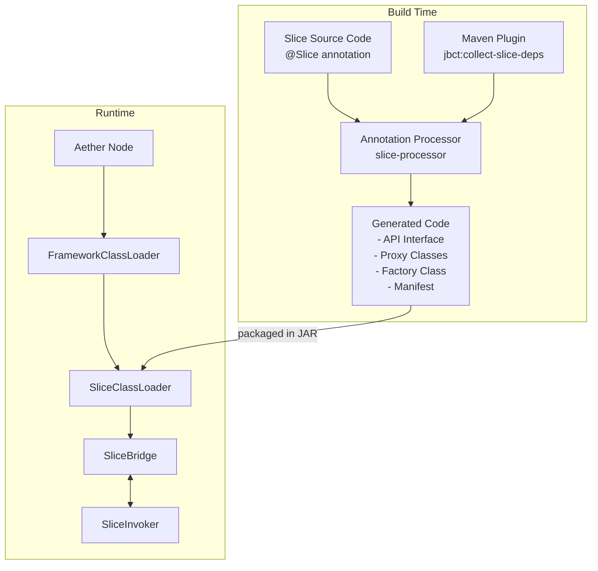
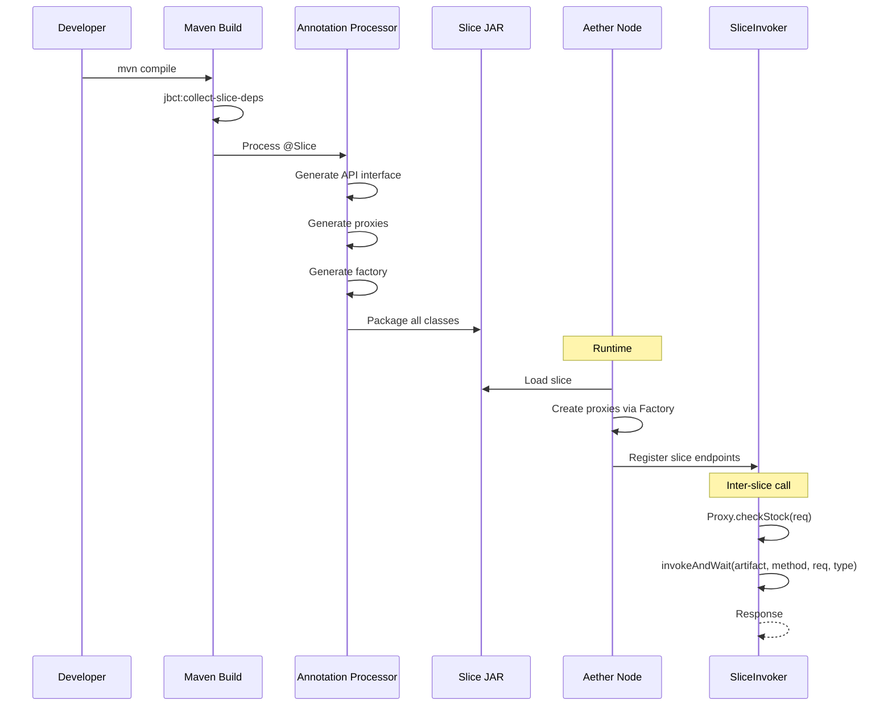
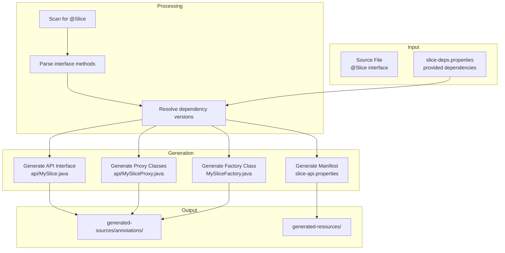
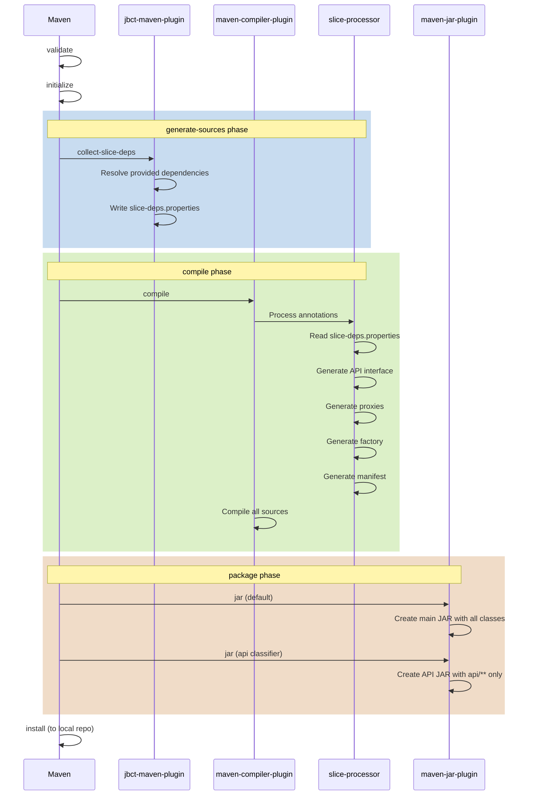
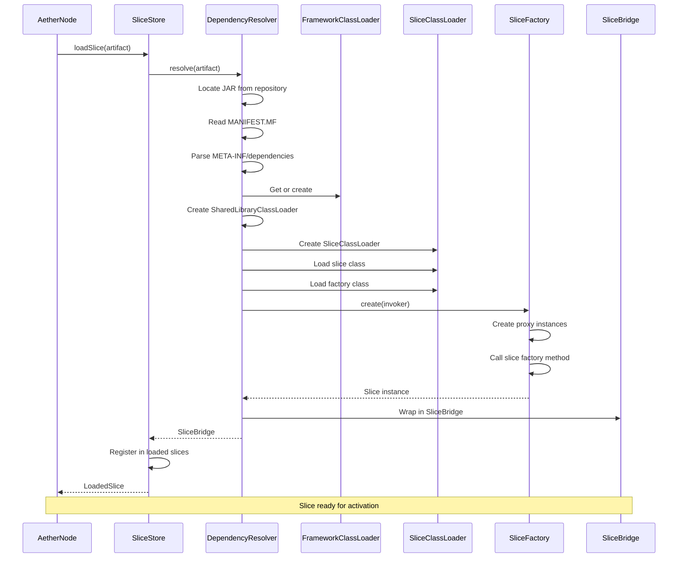
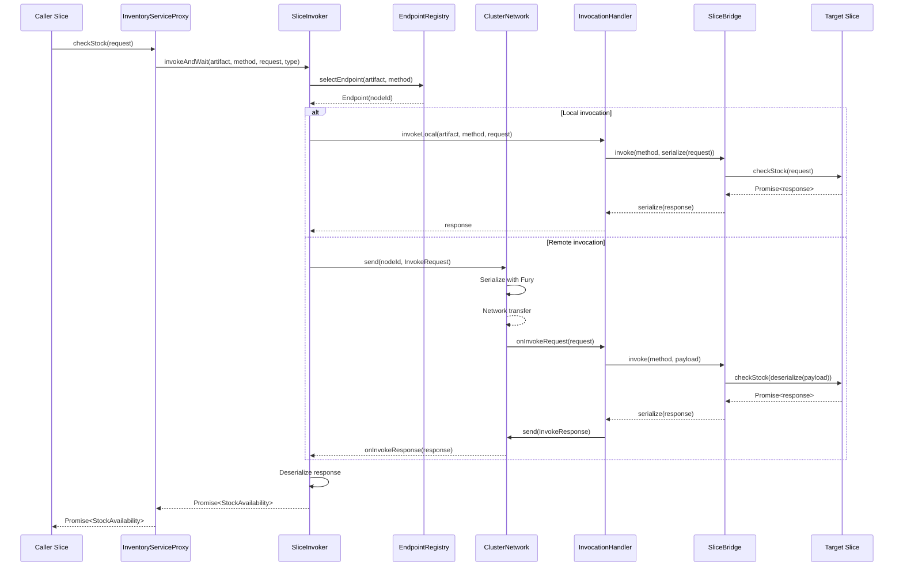

# Typed Slice API Design

## Table of Contents

1. [Introduction](#1-introduction)
2. [Architecture Overview](#2-architecture-overview)
3. [Slice Development Guide](#3-slice-development-guide)
4. [Build System Integration](#4-build-system-integration)
5. [Generated Code Reference](#5-generated-code-reference)
6. [Runtime Behavior](#6-runtime-behavior)
7. [Dependency Resolution](#7-dependency-resolution)
8. [Migration Guide](#8-migration-guide)
9. [Troubleshooting](#9-troubleshooting)
10. [Future Enhancements](#10-future-enhancements)

---

## 1. Introduction

### 1.1 Problem Statement

In the current Aether runtime, inter-slice communication relies on string-based method invocation:

```java
// Current approach - no compile-time type safety
SliceRuntime.sliceInvoker().invokeAndWait(
    "org.example:inventory-service:1.0.0",  // artifact as string
    "checkStock",                            // method name as string
    request,                                 // untyped request
    StockAvailability.class                  // response type
);
```

This approach has several drawbacks:

- **No compile-time verification**: Typos in artifact coordinates or method names only fail at runtime
- **No IDE support**: No autocomplete, no refactoring support, no navigation to definitions
- **Fragile maintenance**: Renaming a method requires finding all string references
- **Poor discoverability**: Developers must read documentation to know available methods
- **Type erasure**: Request/response types must be explicitly specified

### 1.2 Goals

1. **Compile-time type safety**: Detect errors at build time, not runtime
2. **IDE integration**: Full autocomplete, refactoring, and navigation support
3. **Minimal boilerplate**: Annotations and code generation handle the complexity
4. **Backward compatibility**: Existing slices continue to work
5. **Clean separation**: Slice implementations don't depend on node internals
6. **Transparent versioning**: Version management handled automatically via Maven

### 1.3 Non-Goals

- Changing the underlying invocation mechanism (still uses `SliceInvoker` internally)
- Modifying the network protocol between nodes
- Adding new serialization formats

### 1.4 Target Audience

- **Slice developers**: Building business logic as deployable slices
- **Platform engineers**: Setting up Aether infrastructure
- **Contributors**: Understanding the system architecture

---

## 2. Architecture Overview

### 2.1 High-Level System Diagram



### 2.2 Module Dependency Diagram

```mermaid
flowchart BT
    subgraph "Slice Developer Dependencies"
        SA[slice-annotations<br/>@Slice, @SliceMethod]
        API[other-slice:api<br/>typed interfaces]
    end

    subgraph "Runtime Dependencies"
        SAPI[slice-api<br/>Slice, SliceBridge, SliceRuntime]
        SLICE[slice<br/>SliceStore, DependencyResolver]
        NODE[node<br/>AetherNode, InvocationHandler]
        CLUSTER[cluster<br/>Rabia, KVStore]
    end

    subgraph "Build Tools"
        PROC[slice-processor<br/>annotation processor]
        JBCT[jbct-maven-plugin<br/>collect-slice-deps]
    end

    API --> SA
    SAPI --> SA
    SLICE --> SAPI
    NODE --> SLICE
    NODE --> CLUSTER

    PROC --> SA
    JBCT -.-> |generates deps file| PROC
```

### 2.3 Component Interaction Diagram



---

## 3. Slice Development Guide

### 3.1 Creating a New Slice

#### Step 1: Create Maven Module

```xml
<!-- inventory-service/pom.xml -->
<project>
    <groupId>org.example</groupId>
    <artifactId>inventory-service</artifactId>
    <version>1.0.0</version>
    <packaging>jar</packaging>

    <dependencies>
        <!-- Annotations for slice development -->
        <dependency>
            <groupId>org.pragmatica-lite.aether</groupId>
            <artifactId>slice-annotations</artifactId>
            <version>${aether.version}</version>
        </dependency>

        <!-- Pragmatica core for Promise, Result, etc. -->
        <dependency>
            <groupId>org.pragmatica-lite</groupId>
            <artifactId>core</artifactId>
            <version>${pragmatica.version}</version>
        </dependency>
    </dependencies>

    <build>
        <plugins>
            <!-- Annotation processor -->
            <plugin>
                <groupId>org.apache.maven.plugins</groupId>
                <artifactId>maven-compiler-plugin</artifactId>
                <configuration>
                    <annotationProcessorPaths>
                        <path>
                            <groupId>org.pragmatica-lite</groupId>
                            <artifactId>slice-processor</artifactId>
                            <version>${aether.version}</version>
                        </path>
                    </annotationProcessorPaths>
                </configuration>
            </plugin>

            <!-- Creates -api classifier JAR -->
            <plugin>
                <groupId>org.apache.maven.plugins</groupId>
                <artifactId>maven-jar-plugin</artifactId>
                <executions>
                    <execution>
                        <id>api-jar</id>
                        <phase>package</phase>
                        <goals><goal>jar</goal></goals>
                        <configuration>
                            <classifier>api</classifier>
                            <includes>
                                <include>**/api/**</include>
                                <include>META-INF/slice-api.properties</include>
                            </includes>
                        </configuration>
                    </execution>
                </executions>
            </plugin>

            <!-- Collect provided dependencies -->
            <plugin>
                <groupId>org.pragmatica-lite</groupId>
                <artifactId>jbct-maven-plugin</artifactId>
                <version>${jbct.version}</version>
                <executions>
                    <execution>
                        <goals><goal>collect-slice-deps</goal></goals>
                        <phase>generate-sources</phase>
                    </execution>
                </executions>
            </plugin>

            <!-- Standard slice manifest -->
            <plugin>
                <groupId>org.apache.maven.plugins</groupId>
                <artifactId>maven-jar-plugin</artifactId>
                <configuration>
                    <archive>
                        <manifestEntries>
                            <Slice-Artifact>${project.groupId}:${project.artifactId}:${project.version}</Slice-Artifact>
                            <Slice-Class>org.example.inventory.InventoryService</Slice-Class>
                        </manifestEntries>
                    </archive>
                </configuration>
            </plugin>
        </plugins>
    </build>
</project>
```

#### Step 2: Define the Slice Interface

```java
package org.example.inventory;

import org.pragmatica.aether.slice.annotation.Slice;
import org.pragmatica.lang.Promise;

/**
 * Inventory management slice.
 *
 * The @Slice annotation triggers code generation:
 * - API interface in api/ subpackage
 * - Manifest entries for artifact mapping
 */
@Slice
public interface InventoryService {

    /**
     * Check stock availability for a product.
     */
    Promise<StockAvailability> checkStock(CheckStockRequest request);

    /**
     * Reserve stock for an order.
     */
    Promise<StockReservation> reserveStock(ReserveStockRequest request);

    /**
     * Release previously reserved stock.
     */
    Promise<StockReleased> releaseStock(ReleaseStockRequest request);

    /**
     * Factory method - creates the slice implementation.
     * Parameters are injected dependencies (other slices).
     */
    static InventoryService inventoryService() {
        return new InventoryServiceImpl();
    }
}
```

#### Step 3: Implement the Slice

```java
package org.example.inventory;

import org.pragmatica.lang.Promise;

/**
 * Implementation of the inventory service.
 */
record InventoryServiceImpl() implements InventoryService {

    @Override
    public Promise<StockAvailability> checkStock(CheckStockRequest request) {
        // Business logic here
        return Promise.success(new StockAvailability(
            request.productId(),
            100,  // available quantity
            true  // in stock
        ));
    }

    @Override
    public Promise<StockReservation> reserveStock(ReserveStockRequest request) {
        // Reserve stock logic
        return Promise.success(new StockReservation(
            request.orderId(),
            request.productId(),
            request.quantity(),
            "RES-" + System.currentTimeMillis()
        ));
    }

    @Override
    public Promise<StockReleased> releaseStock(ReleaseStockRequest request) {
        // Release logic
        return Promise.success(new StockReleased(
            request.reservationId(),
            true
        ));
    }
}
```

#### Step 4: Define Request/Response Types

```java
package org.example.inventory;

// Request types
public record CheckStockRequest(String productId, int requestedQuantity) {}
public record ReserveStockRequest(String orderId, String productId, int quantity) {}
public record ReleaseStockRequest(String reservationId) {}

// Response types
public record StockAvailability(String productId, int availableQuantity, boolean inStock) {}
public record StockReservation(String orderId, String productId, int quantity, String reservationId) {}
public record StockReleased(String reservationId, boolean released) {}
```

### 3.2 Adding Typed Dependencies

When a slice needs to call another slice, add it as a `provided` dependency:

```xml
<!-- place-order/pom.xml -->
<dependencies>
    <!-- Typed API for inventory service -->
    <dependency>
        <groupId>org.example</groupId>
        <artifactId>inventory-service</artifactId>
        <classifier>api</classifier>
        <scope>provided</scope>
    </dependency>

    <!-- Typed API for pricing service -->
    <dependency>
        <groupId>org.example</groupId>
        <artifactId>pricing-service</artifactId>
        <classifier>api</classifier>
        <scope>provided</scope>
    </dependency>
</dependencies>
```

Then declare dependencies in the factory method:

```java
package org.example.order;

import org.pragmatica.aether.slice.annotation.Slice;
import org.example.inventory.api.InventoryService;
import org.example.pricing.api.PricingService;

@Slice
public interface PlaceOrder {

    Promise<OrderResult> placeOrder(PlaceOrderRequest request);

    /**
     * Factory method with typed dependencies.
     * The annotation processor generates proxies for these parameters.
     */
    static PlaceOrder placeOrder(InventoryService inventory, PricingService pricing) {
        return new PlaceOrderImpl(inventory, pricing);
    }
}
```

```java
package org.example.order;

record PlaceOrderImpl(
    InventoryService inventory,
    PricingService pricing
) implements PlaceOrder {

    @Override
    public Promise<OrderResult> placeOrder(PlaceOrderRequest request) {
        // Type-safe calls to other slices
        return inventory.checkStock(new CheckStockRequest(request.productId(), request.quantity()))
            .flatMap(stock -> {
                if (!stock.inStock()) {
                    return Promise.success(OrderResult.outOfStock(request.productId()));
                }
                return pricing.calculatePrice(new PriceRequest(request.productId(), request.quantity()))
                    .flatMap(price ->
                        inventory.reserveStock(new ReserveStockRequest(
                            request.orderId(),
                            request.productId(),
                            request.quantity()
                        ))
                        .map(reservation -> OrderResult.success(
                            request.orderId(),
                            price.totalPrice(),
                            reservation.reservationId()
                        ))
                    );
            });
    }
}
```

### 3.3 Project Structure Conventions

```
my-slice/
├── pom.xml
├── src/
│   └── main/
│       ├── java/
│       │   └── org/example/myslice/
│       │       ├── MySlice.java          # @Slice interface
│       │       ├── MySliceImpl.java      # Implementation
│       │       ├── MyRequest.java        # Request types
│       │       ├── MyResponse.java       # Response types
│       │       └── api/                  # Generated (or hand-written)
│       │           └── MySlice.java      # API interface (same methods)
│       └── resources/
│           └── META-INF/
│               └── dependencies/
│                   └── org.example.myslice.MySlice  # Runtime deps
└── target/
    ├── classes/
    ├── generated-sources/
    │   └── annotations/
    │       └── org/example/myslice/
    │           └── api/
    │               └── MySlice.java      # Generated API
    ├── my-slice-1.0.0.jar               # Full slice JAR
    └── my-slice-1.0.0-api.jar           # API-only JAR
```

### 3.4 Maven Configuration Templates

#### Minimal Slice POM

```xml
<?xml version="1.0" encoding="UTF-8"?>
<project xmlns="http://maven.apache.org/POM/4.0.0"
         xmlns:xsi="http://www.w3.org/2001/XMLSchema-instance"
         xsi:schemaLocation="http://maven.apache.org/POM/4.0.0
                             http://maven.apache.org/xsd/maven-4.0.0.xsd">
    <modelVersion>4.0.0</modelVersion>

    <parent>
        <groupId>org.pragmatica-lite.aether</groupId>
        <artifactId>slice-parent</artifactId>
        <version>${aether.version}</version>
    </parent>

    <groupId>org.example</groupId>
    <artifactId>my-slice</artifactId>
    <version>1.0.0</version>

    <properties>
        <slice.class>org.example.myslice.MySlice</slice.class>
    </properties>

    <dependencies>
        <!-- Add slice API dependencies here with scope=provided -->
    </dependencies>
</project>
```

The parent POM (`slice-parent`) configures:
- Annotation processor
- API JAR creation
- Dependency collection plugin
- Manifest generation

---

## 4. Build System Integration

### 4.1 Annotation Processor Flow



### 4.2 Maven Plugin Responsibilities

#### jbct:collect-slice-deps Goal

**Phase:** `generate-sources` (runs before compile)

**Purpose:** Collect all `<scope>provided</scope>` dependencies with their resolved versions and write to a properties file.

**Input:**
- POM dependencies with `scope=provided`
- Maven dependency resolution

**Output:** `target/slice-deps.properties`
```properties
# Generated by jbct:collect-slice-deps
# Format: groupId\:artifactId\:classifier=version
org.example\:inventory-service\:api=1.0.0
org.example\:pricing-service\:api=1.2.0
```

**Configuration:**
```xml
<plugin>
    <groupId>org.pragmatica-lite</groupId>
    <artifactId>jbct-maven-plugin</artifactId>
    <executions>
        <execution>
            <id>collect-deps</id>
            <goals><goal>collect-slice-deps</goal></goals>
            <phase>generate-sources</phase>
            <configuration>
                <outputFile>${project.build.directory}/slice-deps.properties</outputFile>
                <includeClassifiers>api</includeClassifiers>
            </configuration>
        </execution>
    </executions>
</plugin>
```

#### jbct:verify Goal

**Phase:** `verify` (runs after tests)

**Purpose:** Validate slice configuration and detect common mistakes.

**Checks:**
- All factory method parameters have corresponding provided dependencies
- API interfaces match implementation interfaces
- Manifest entries are present and correct
- No circular dependencies

### 4.3 Build Phase Sequence



### 4.4 Monorepo vs Cross-Repo Builds

#### Monorepo (Single Repository)

All slices in one repository, Maven reactor handles build order:

```
aether-demo/
├── pom.xml (parent)
├── inventory-service/
├── pricing-service/
├── order-service/
└── notification-service/
```

```xml
<!-- Parent POM -->
<modules>
    <module>inventory-service</module>    <!-- No deps, builds first -->
    <module>pricing-service</module>       <!-- No deps, builds first -->
    <module>order-service</module>         <!-- Depends on inventory, pricing -->
    <module>notification-service</module>  <!-- Depends on order -->
</modules>
```

Maven automatically:
1. Analyzes inter-module dependencies
2. Builds modules in correct order
3. Makes API JARs available to dependent modules

#### Cross-Repo (Separate Repositories)

Each slice in its own repository:

1. **Upstream slice** (inventory-service repo):
   ```bash
   mvn deploy
   ```
   Publishes to artifact repository:
   - `inventory-service-1.0.0.jar`
   - `inventory-service-1.0.0-api.jar`

2. **Downstream slice** (order-service repo):
   ```xml
   <dependency>
       <groupId>org.example</groupId>
       <artifactId>inventory-service</artifactId>
       <version>1.0.0</version>
       <classifier>api</classifier>
       <scope>provided</scope>
   </dependency>
   ```
   Maven resolves from artifact repository.

---

## 5. Generated Code Reference

### 5.1 API Interface Generation Rules

The annotation processor generates an API interface by:

1. **Copying method signatures**: All non-static, non-default methods
2. **Preserving generics**: Type parameters are preserved
3. **Removing annotations**: Only `@Deprecated` is preserved
4. **Adding package**: Placed in `.api` subpackage
5. **Removing factory method**: Static factory is not copied

**Source (implementation interface):**
```java
package org.example.inventory;

@Slice
public interface InventoryService {
    Promise<StockAvailability> checkStock(CheckStockRequest request);
    Promise<StockReservation> reserveStock(ReserveStockRequest request);

    @Deprecated
    Promise<LegacyResponse> legacyMethod(LegacyRequest request);

    default Promise<Unit> healthCheck() {
        return Promise.success(Unit.unit());
    }

    static InventoryService inventoryService() {
        return new InventoryServiceImpl();
    }
}
```

**Generated (API interface):**
```java
package org.example.inventory.api;

/**
 * API interface for InventoryService slice.
 * Generated by slice-processor - do not edit manually.
 *
 * @see org.example.inventory.InventoryService
 */
public interface InventoryService {
    Promise<StockAvailability> checkStock(CheckStockRequest request);
    Promise<StockReservation> reserveStock(ReserveStockRequest request);

    @Deprecated
    Promise<LegacyResponse> legacyMethod(LegacyRequest request);

    // Note: default methods and static factory not copied
}
```

### 5.2 Proxy Class Structure

For each API interface parameter in the factory method, a proxy class is generated:

```java
package org.example.order.api;

import org.pragmatica.aether.slice.SliceRuntime.SliceInvokerFacade;
import org.pragmatica.lang.Promise;
import org.example.inventory.api.InventoryService;

/**
 * Proxy implementation of InventoryService.
 * Delegates all calls to SliceInvoker.
 * Generated by slice-processor - do not edit manually.
 */
public final class InventoryServiceProxy implements InventoryService {

    private final SliceInvokerFacade invoker;
    private final String artifact;

    public InventoryServiceProxy(SliceInvokerFacade invoker, String artifact) {
        this.invoker = invoker;
        this.artifact = artifact;
    }

    @Override
    public Promise<StockAvailability> checkStock(CheckStockRequest request) {
        return invoker.invokeAndWait(
            artifact,
            "checkStock",
            request,
            StockAvailability.class
        );
    }

    @Override
    public Promise<StockReservation> reserveStock(ReserveStockRequest request) {
        return invoker.invokeAndWait(
            artifact,
            "reserveStock",
            request,
            StockReservation.class
        );
    }

    @Override
    public Promise<LegacyResponse> legacyMethod(LegacyRequest request) {
        return invoker.invokeAndWait(
            artifact,
            "legacyMethod",
            request,
            LegacyResponse.class
        );
    }

    @Override
    public String toString() {
        return "InventoryServiceProxy[" + artifact + "]";
    }
}
```

### 5.3 Factory Class Structure

The factory class wires everything together:

```java
package org.example.order;

import org.pragmatica.aether.slice.SliceRuntime.SliceInvokerFacade;
import org.example.inventory.api.InventoryService;
import org.example.inventory.api.InventoryServiceProxy;
import org.example.pricing.api.PricingService;
import org.example.pricing.api.PricingServiceProxy;

/**
 * Factory for PlaceOrder slice.
 * Creates proxy instances and calls the slice factory method.
 * Generated by slice-processor - do not edit manually.
 */
public final class PlaceOrderFactory {

    private PlaceOrderFactory() {
        // Utility class
    }

    /**
     * Create PlaceOrder slice with all dependencies.
     *
     * @param invoker The slice invoker for remote calls
     * @return Configured PlaceOrder instance
     */
    public static PlaceOrder create(SliceInvokerFacade invoker) {
        // Create proxies for all dependencies
        InventoryService inventory = new InventoryServiceProxy(
            invoker,
            "org.example:inventory-service:1.0.0"
        );

        PricingService pricing = new PricingServiceProxy(
            invoker,
            "org.example:pricing-service:1.2.0"
        );

        // Call the original factory method
        return PlaceOrder.placeOrder(inventory, pricing);
    }

    /**
     * Dependency information for this slice.
     */
    public static final class Dependencies {
        public static final String INVENTORY_SERVICE = "org.example:inventory-service:1.0.0";
        public static final String PRICING_SERVICE = "org.example:pricing-service:1.2.0";

        private Dependencies() {}
    }
}
```

### 5.4 Manifest File Format

Generated in `META-INF/slice-api.properties`:

```properties
# Slice API manifest
# Generated by slice-processor - do not edit manually

# API artifact coordinates (with classifier)
api.artifact=org.example:inventory-service:api

# Slice artifact coordinates (without classifier)
slice.artifact=org.example:inventory-service

# Fully qualified name of the API interface
api.interface=org.example.inventory.api.InventoryService

# Fully qualified name of the implementation interface
impl.interface=org.example.inventory.InventoryService

# Generated timestamp
generated.timestamp=2025-01-15T10:30:00Z

# Processor version
processor.version=0.7.0
```

---

## 6. Runtime Behavior

### 6.1 ClassLoader Hierarchy

```mermaid
flowchart BT
    BOOT[Bootstrap ClassLoader<br/>JDK classes: java.*, javax.*]

    APP[Application ClassLoader<br/>Node runtime, cluster, metrics]

    FCL[FrameworkClassLoader<br/>pragmatica-lite:core<br/>slice-api]

    SHARED[SharedLibraryClassLoader<br/>Shared dependencies from [shared]]

    SCL1[SliceClassLoader<br/>inventory-service]
    SCL2[SliceClassLoader<br/>pricing-service]
    SCL3[SliceClassLoader<br/>order-service]

    APP --> BOOT
    FCL --> BOOT
    SHARED --> FCL
    SCL1 --> SHARED
    SCL2 --> SHARED
    SCL3 --> SHARED

    style BOOT fill:#f9f,stroke:#333
    style APP fill:#bbf,stroke:#333
    style FCL fill:#bfb,stroke:#333
    style SHARED fill:#fbf,stroke:#333
    style SCL1 fill:#fbb,stroke:#333
    style SCL2 fill:#fbb,stroke:#333
    style SCL3 fill:#fbb,stroke:#333
```

**Key points:**

1. **Bootstrap ClassLoader**: JDK classes only
2. **Application ClassLoader**: Node-side code (isolated from slices)
3. **FrameworkClassLoader**: Shared framework for all slices (bypasses Application)
4. **SharedLibraryClassLoader**: Libraries declared in `[shared]` section
5. **SliceClassLoader**: Per-slice isolation

**Isolation guarantees:**
- Slices cannot access Node internals
- Slices cannot interfere with each other
- Framework classes are shared (efficiency)
- Shared libraries are loaded once

### 6.2 Slice Loading Sequence



### 6.3 Invocation Flow



### 6.4 Error Handling and Diagnostics

#### Error Categories

| Error Type | Cause | Handling |
|------------|-------|----------|
| `SliceNotFound` | Target slice not deployed | Return failure, log warning |
| `MethodNotFound` | Invalid method name | Return failure, log error |
| `SerializationError` | Type mismatch | Return failure, include details |
| `InvocationTimeout` | Target unresponsive | Retry with backoff, then fail |
| `NetworkError` | Connection lost | Retry on different node |

#### Diagnostic Logging

Enable detailed logging with:
```properties
# Log slice loading
logging.level.org.pragmatica.aether.slice=DEBUG

# Log invocations
logging.level.org.pragmatica.aether.invoke=DEBUG

# Log classloader activity
logging.level.org.pragmatica.aether.slice.SliceClassLoader=TRACE
```

---

## 7. Dependency Resolution

### 7.1 DependencyFile Format Specification

Location: `META-INF/dependencies/{fully.qualified.ClassName}`

```
# Dependency file for org.example.order.PlaceOrder
# Lines starting with # are comments
# Empty lines are ignored

[api]
# API modules for typed dependencies
# Format: groupId:artifactId:versionPattern
org.example:inventory-service:api:^1.0.0
org.example:pricing-service:api:^1.0.0

[shared]
# Libraries shared across all slices
# Loaded into SharedLibraryClassLoader
org.pragmatica-lite:core:^0.9.0
com.fasterxml.jackson.core:jackson-databind:^2.15.0

[slices]
# Runtime slice dependencies (for non-typed usage)
# Loaded when slice activates
org.example:legacy-service:^1.0.0
```

### 7.2 Resolution Algorithm

```mermaid
flowchart TD
    START[Start: resolve(artifact)]

    CACHE{In registry?}
    START --> CACHE
    CACHE -->|Yes| RETURN_CACHED[Return cached]
    CACHE -->|No| LOCATE

    LOCATE[Locate JAR in repository]
    LOCATE --> MANIFEST[Read MANIFEST.MF]
    MANIFEST --> DEPS[Load dependency file]

    DEPS --> API_SECTION{Has [api] section?}
    API_SECTION -->|Yes| LOAD_API[Load API JARs<br/>into SharedLibraryClassLoader]
    API_SECTION -->|No| SHARED_SECTION

    LOAD_API --> SHARED_SECTION{Has [shared] section?}
    SHARED_SECTION -->|Yes| LOAD_SHARED[Load shared JARs<br/>Check version conflicts]
    SHARED_SECTION -->|No| CREATE_SCL

    LOAD_SHARED --> CONFLICT{Version conflict?}
    CONFLICT -->|Yes| CONFLICT_JAR[Add to SliceClassLoader<br/>instead of shared]
    CONFLICT -->|No| CREATE_SCL
    CONFLICT_JAR --> CREATE_SCL

    CREATE_SCL[Create SliceClassLoader]
    CREATE_SCL --> LOAD_CLASS[Load slice class]
    LOAD_CLASS --> LOAD_FACTORY[Load factory class]

    LOAD_FACTORY --> HAS_DEPS{Has dependencies?}
    HAS_DEPS -->|Yes| CREATE_PROXIES[Create proxy instances<br/>via generated factory]
    HAS_DEPS -->|No| CREATE_SLICE

    CREATE_PROXIES --> CREATE_SLICE[Create slice instance]
    CREATE_SLICE --> WRAP[Wrap in SliceBridge]
    WRAP --> REGISTER[Register in SliceRegistry]
    REGISTER --> RETURN[Return SliceBridge]
```

### 7.3 Version Matching Rules

| Pattern | Meaning | Example Match |
|---------|---------|---------------|
| `1.0.0` | Exact version | Only `1.0.0` |
| `^1.0.0` | Compatible (same major) | `1.0.0`, `1.5.2`, not `2.0.0` |
| `~1.0.0` | Patch updates only | `1.0.0`, `1.0.5`, not `1.1.0` |
| `>=1.0.0` | Minimum version | `1.0.0`, `2.5.0`, `10.0.0` |
| `[1.0.0,2.0.0)` | Range (inclusive start, exclusive end) | `1.0.0`, `1.9.9`, not `2.0.0` |

### 7.4 Conflict Resolution

When the same library is requested with incompatible versions:

1. **First loaded wins** for SharedLibraryClassLoader
2. **Conflicting JARs** loaded into SliceClassLoader (child-first lookup)
3. **Slice isolation** ensures no cross-contamination

Example:
```
Slice A requests: jackson:^2.14.0 → loads 2.14.2 into shared
Slice B requests: jackson:^2.16.0 → conflict! loads 2.16.0 into B's classloader
```

---

## 8. Migration Guide

### 8.1 Migrating Existing Slices

#### Before (String-Based)

```java
// Old slice - uses string-based invocation
public record PlaceOrderSlice() implements Slice {
    private static final String INVENTORY = "org.example:inventory-service:1.0.0";

    private SliceInvokerFacade invoker() {
        return SliceRuntime.sliceInvoker();
    }

    public Promise<OrderResult> placeOrder(PlaceOrderRequest request) {
        return invoker().invokeAndWait(
            INVENTORY,
            "checkStock",
            new CheckStockRequest(request.productId(), request.quantity()),
            StockAvailability.class
        ).flatMap(stock -> {
            // ...
        });
    }

    @Override
    public List<SliceMethod<?, ?>> methods() {
        return List.of(
            new SliceMethod<>(
                MethodName.methodName("placeOrder").unwrap(),
                this::placeOrder,
                new TypeToken<OrderResult>() {},
                new TypeToken<PlaceOrderRequest>() {}
            )
        );
    }

    @Override
    public Promise<Unit> start() { return Promise.success(Unit.unit()); }

    @Override
    public Promise<Unit> stop() { return Promise.success(Unit.unit()); }
}
```

#### After (Typed)

```java
// New slice - uses typed interfaces
package org.example.order;

import org.pragmatica.aether.slice.annotation.Slice;
import org.example.inventory.api.InventoryService;

@Slice
public interface PlaceOrder {

    Promise<OrderResult> placeOrder(PlaceOrderRequest request);

    static PlaceOrder placeOrder(InventoryService inventory) {
        return new PlaceOrderImpl(inventory);
    }
}

record PlaceOrderImpl(InventoryService inventory) implements PlaceOrder {

    @Override
    public Promise<OrderResult> placeOrder(PlaceOrderRequest request) {
        // Type-safe call - no strings!
        return inventory.checkStock(new CheckStockRequest(
            request.productId(),
            request.quantity()
        )).flatMap(stock -> {
            // ...
        });
    }
}
```

### 8.2 Step-by-Step Migration

1. **Add annotation dependency**
   ```xml
   <dependency>
       <groupId>org.pragmatica-lite.aether</groupId>
       <artifactId>slice-annotations</artifactId>
   </dependency>
   ```

2. **Add API dependencies**
   ```xml
   <dependency>
       <groupId>org.example</groupId>
       <artifactId>inventory-service</artifactId>
       <classifier>api</classifier>
       <scope>provided</scope>
   </dependency>
   ```

3. **Convert to interface pattern**
   - Change from `record ... implements Slice` to `interface ... @Slice`
   - Move implementation to separate record
   - Add factory method with dependencies

4. **Configure build plugins**
   - Add annotation processor path
   - Add API JAR execution
   - Add dependency collector

5. **Remove manual invocation code**
   - Remove `SliceRuntime.sliceInvoker()` calls
   - Use injected interface methods

6. **Update dependency file**
   - Add `[api]` section for typed dependencies
   - Move appropriate entries from `[slices]`

### 8.3 Common Pitfalls

| Pitfall | Symptom | Solution |
|---------|---------|----------|
| Missing API dependency | Compile error: cannot find symbol | Add `<classifier>api</classifier>` dependency |
| Wrong scope | Runtime ClassNotFoundException | Use `scope=provided` for API deps |
| Factory signature mismatch | Generated factory has wrong parameters | Ensure factory params match dependencies |
| Circular dependency | Stack overflow at load time | Refactor to break cycle |
| Version mismatch | Runtime InvocationError | Ensure API and impl versions align |

### 8.4 Validation Checklist

- [ ] `@Slice` annotation present on interface
- [ ] Factory method is static and returns interface type
- [ ] Factory parameter types match API interface types
- [ ] All API dependencies declared with `scope=provided`
- [ ] API dependencies have `classifier=api`
- [ ] Build plugins configured in POM
- [ ] Generated sources visible in IDE
- [ ] API JAR created during build

---

## 9. Troubleshooting

### 9.1 Common Errors and Solutions

#### "Slice class not found"

**Cause:** SliceClassLoader cannot find the slice class.

**Solutions:**
1. Verify `Slice-Class` manifest entry
2. Check JAR contains the class
3. Ensure classloader hierarchy is correct

```bash
# Check JAR contents
jar tf my-slice-1.0.0.jar | grep MySlice

# Check manifest
unzip -p my-slice-1.0.0.jar META-INF/MANIFEST.MF
```

#### "Factory method not found"

**Cause:** Annotation processor couldn't find valid factory method.

**Solutions:**
1. Factory must be `static`
2. Factory must return the interface type
3. Factory name must be lowercase-first of class name

```java
// Correct
static MySlice mySlice(Dep1 d1, Dep2 d2) { ... }

// Wrong - not static
MySlice mySlice(Dep1 d1) { ... }

// Wrong - wrong name
static MySlice createSlice(Dep1 d1) { ... }
```

#### "Cannot resolve dependency version"

**Cause:** Annotation processor cannot find version for a dependency.

**Solutions:**
1. Ensure `jbct:collect-slice-deps` runs before compile
2. Check `target/slice-deps.properties` exists
3. Verify dependency has `scope=provided`

#### "API interface mismatch"

**Cause:** Generated API interface doesn't match implementation.

**Solutions:**
1. Clean and rebuild: `mvn clean compile`
2. Delete `target/generated-sources` and rebuild
3. Check for manual edits to generated files

### 9.2 Diagnostic Commands

```bash
# Verify slice JAR structure
jar tf my-slice-1.0.0.jar

# Check API JAR structure
jar tf my-slice-1.0.0-api.jar

# View manifest
unzip -p my-slice-1.0.0.jar META-INF/MANIFEST.MF

# View slice-api.properties
unzip -p my-slice-1.0.0-api.jar META-INF/slice-api.properties

# View dependency file
unzip -p my-slice-1.0.0.jar META-INF/dependencies/org.example.MySlice

# Check generated sources
ls -la target/generated-sources/annotations/

# Validate with JBCT
mvn jbct:verify
```

### 9.3 Debug Logging

Add to `logback.xml` or equivalent:

```xml
<!-- Annotation processor logging -->
<logger name="org.pragmatica.jbct.slice" level="DEBUG"/>

<!-- Slice loading -->
<logger name="org.pragmatica.aether.slice.dependency" level="DEBUG"/>

<!-- ClassLoader activity -->
<logger name="org.pragmatica.aether.slice.SliceClassLoader" level="TRACE"/>
<logger name="org.pragmatica.aether.slice.FrameworkClassLoader" level="TRACE"/>

<!-- Invocation tracing -->
<logger name="org.pragmatica.aether.invoke" level="DEBUG"/>
```

---

## 10. Future Enhancements

### 10.1 Multi-Slice Modules

Support multiple `@Slice` interfaces in a single module:

```
multi-service/
├── src/main/java/org/example/
│   ├── UserService.java      (@Slice)
│   ├── OrderService.java     (@Slice)
│   └── api/
│       ├── UserService.java
│       └── OrderService.java
└── target/
    ├── multi-service-1.0.0.jar
    ├── multi-service-1.0.0-user-api.jar
    └── multi-service-1.0.0-order-api.jar
```

### 10.2 Hot Reloading

Reload slice implementations without node restart:

1. Watch for JAR changes in repository
2. Gracefully drain existing requests
3. Load new version in fresh classloader
4. Switch traffic to new version
5. Unload old classloader

### 10.3 IDE Integration

IntelliJ IDEA / Eclipse plugins:

- Navigate from proxy call to implementation
- Refactoring support across API boundary
- Live validation of slice configuration
- Generate slice from template

### 10.4 Contract Testing

Automatic contract verification:

1. Extract interface contract from API JAR
2. Generate test cases for each method
3. Run against implementation
4. Fail build if contract violated

---

## Appendix A: Complete Example

See `examples/order-demo/` in the Aether repository for a complete working example with:

- 5 interacting slices
- Typed dependencies
- Full Maven configuration
- Integration tests
